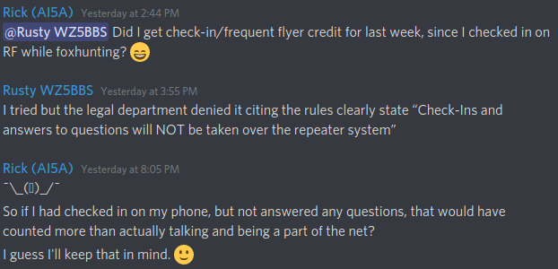

# Crowdpurr Weekly Login

This uses GitHub Actions and Puppeteer to log into Crowdpurr weekly.

Checking in on the website is valued more than actually participating and
talking, so this ensures a valid check-in every week.

It uses GitHub Actions which allows one to specify a cron-style time format
for automatic workflow runs. We
[specify](https://github.com/relrod/oharc-trivia-login/blob/master/.github/workflows/crowdpurr.yml#L3)
one that runs each week, on (UTC) Saturday 03:30. (It is worth noting that
GitHub wants the timestamps in UTC. So in CDT, we'll end up checking in at
10:30pm, and in CST 9:30pm. This is fine since late check-ins are allowed. We
also need to ensure that we check in post-bingo, so 30 minutes after net start
allows for some buffer.)

## License

MIT
